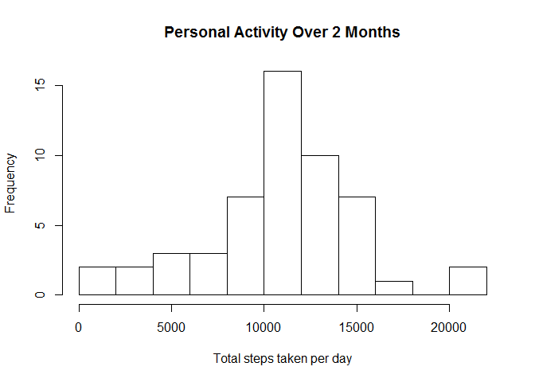
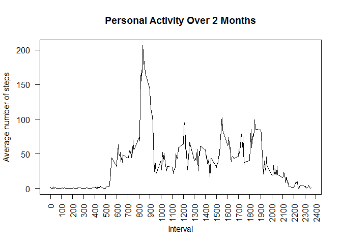
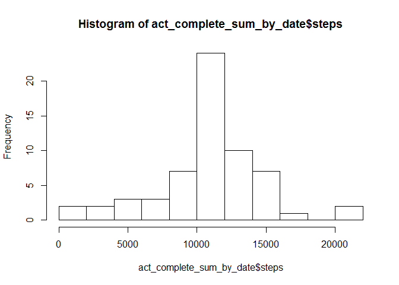

# Reproducible Research: Peer Assessment 1
 

## Loading and preprocessing the data

```r
fname <- "activity.csv"
zipfile<- "repdata-data-activity.zip"
url <- "http://d396qusza40orc.cloudfront.net/repdata%2Fdata%2Factivity.zip"
if (!file.exists(fname)) {
  if (!file.exists(zipfile)) {
    download.file(url,destfile=zipfile)
  }
  unzip(zipfile)
}
act<-read.csv("activity.csv") 
```


## What is mean total number of steps taken per day?
first get the summary of steps taken each day

```r
act_sum_by_date <- aggregate(steps~date,data=act,sum)  
```


```r
hist(act_sum_by_date$steps, 
     breaks=12,
     xlab="Total steps taken per day",
     main = "Personal Activity Over 2 Months")
```

 

get the mean and median from the summary figures

```r
summary(act_sum_by_date)
```

```
##          date        steps      
##  2012-10-02: 1   Min.   :   41  
##  2012-10-03: 1   1st Qu.: 8841  
##  2012-10-04: 1   Median :10765  
##  2012-10-05: 1   Mean   :10766  
##  2012-10-06: 1   3rd Qu.:13294  
##  2012-10-07: 1   Max.   :21194  
##  (Other)   :47
```

```
## The Mean of total number of steps taken per day 10766
```

```
## The Median of total number of steps taken per day 10765
```

## What is the average daily activity pattern?
first get the average of steps per 5 minute interval

```r
act_sum_by_int <- aggregate(steps~interval,data=act,mean)
```

```r
plot(act_sum_by_int$interval,act_sum_by_int$steps,type="l",
     xlab="Interval",ylab="Average number of steps", 
     main = "Personal Activity Over 2 Months", 
     xaxt="n",yaxt="n")
axis(1,at=seq(0,2500,100),las=2)
axis(2,las=1)
```

 

```
## The maximum number of steps is in interval 835
```

## Imputing missing values
Calculate the number of missing values in the activity dataset

```r
nrow(act[is.na(act$steps),])
```

```
## [1] 2304
```

Create a new dataset with missing values set to the mean for that interval

```r
act_complete <- act
for (i in 1:nrow(act_complete)) {
    if (is.na(act_complete[i,"steps"]))
      act_complete[i,"steps"]<-act_sum_by_int[act_sum_by_int$interval==act_complete[i,"interval"],"steps"]
}
```

Aggregate the number of steps taken each day for the dataset with no missing values

```r
act_complete_sum_by_date <- aggregate(steps~date,data=act_complete,sum)
```

```r
hist(act_complete_sum_by_date$steps,breaks=10)
```

 
get the mean and median from the summary figures

```r
summary(act_complete_sum_by_date)
```

```
##          date        steps      
##  2012-10-01: 1   Min.   :   41  
##  2012-10-02: 1   1st Qu.: 9819  
##  2012-10-03: 1   Median :10766  
##  2012-10-04: 1   Mean   :10766  
##  2012-10-05: 1   3rd Qu.:12811  
##  2012-10-06: 1   Max.   :21194  
##  (Other)   :55
```

```
## After imputing missing values:
```

```
## The Mean of total number of steps taken per day 10766
```

```
## The Median of total number of steps taken per day 10766
```

```
## There does not seem to be much impact from imputing missing values.
```

## Are there differences in activity patterns between weekdays and weekends?
Classify data into weekday and weekend

```r
act_complete$daytype <- as.factor(ifelse(weekdays(as.Date(act_complete$date)) %in% c("Sunday","Saturday"),"weekend","weekday"))
act_c_daytype<-aggregate(steps~daytype+interval,data=act_complete,mean)
```

```r
library(lattice)
xyplot(steps~interval | daytype, data=act_c_daytype,type="l",layout=c(1,2))
```

 


